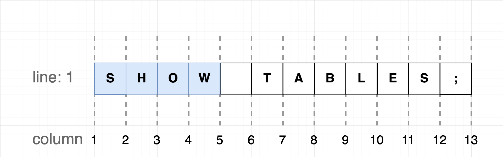
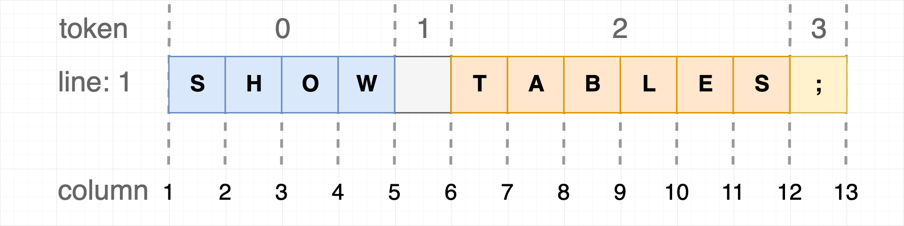

# dt-sql-parser

[![NPM version][npm-image]][npm-url] [![NPM downloads][download-img]][download-url] [![Chat][online-chat-img]][online-chat-url]

[npm-image]: https://img.shields.io/npm/v/dt-sql-parser.svg?style=flat-square
[npm-url]: https://www.npmjs.com/package/dt-sql-parser

[download-img]: https://img.shields.io/npm/dm/dt-sql-parser.svg?style=flat
[download-url]: https://www.npmjs.com/package/dt-sql-parser

[online-chat-img]: https://img.shields.io/discord/920616811261743104?logo=Molecule
[online-chat-url]: https://discord.gg/uVvq6mfPfa

[English](./README.md) | 简体中文

dt-sql-parser 是一个基于 [ANTLR4](https://github.com/antlr/antlr4) 开发的， 针对大数据领域的 **SQL Parser** 项目。通过[ANTLR4](https://github.com/antlr/antlr4) 生成的 Parser、Visitor 和 Listener，我们可以轻松的做到对 SQL 语句的**语法检查**（Syntax Validation）、**词法分析**（Tokenizer)、 **遍历 AST** 节点等功能。此外，还提供了一些辅助方法, 例如 **SQL 切割（Split）**、**自动补全**等。

**已支持的 SQL 类型：**

- MySQL
- Flink SQL
- Spark SQL
- Hive SQL
- PostgreSQL
- Trino SQL
- Impala SQL

**SQL 辅助方法支持**

| SQL 类型     | SQL 切割 | 自动补全   |
| ----------- | -------- | -------- |
| MySQL       | ✅       | ✅        |
| Flink SQL   | ✅       | ✅        |
| Spark SQL   | ✅       | ✅        |
| Hive SQL    | ✅       | ✅        |
| PostgreSQL  | ✅       | ✅        |
| Trino SQL   | ✅       | ✅        |
| Impala SQL  | ✅       | ✅        |

> 提示：当前的 Parser 是 `Javascript` 语言版本，如果有必要，可以尝试编译 Grammar 文件到其他目标语言。

<br/>

## 与 MonacoEditor 集成
我们提供了[monaco-sql-languages](https://github.com/DTStack/monaco-sql-languages)，通过它你可以轻易的将`dt-sql-parser`与`monaco-editor`集成。

>提示：如果想要在浏览器中运行 `dt-sql-parser`，请不要忘记安装 `assert` 和 `util` 的 polyfills 包，另外还需要定义全局变量 `process.env`。 在 node 环境中则不需要，因为 node 内置了这些。

<br/>

## 安装

```bash
# use npm
npm i dt-sql-parser --save

# use yarn
yarn add dt-sql-parser
```

<br/>

## 使用
在开始使用前，需要先了解基本用法。`dt-sql-parser` 为不同类型的 SQL 分别提供相应的 SQL Parser 类：
```javascript
import { MySQL, FlinkSQL, SparkSQL, HiveSQL, PostgresSQL, TrinoSQL, ImpalaSQL } from 'dt-sql-parser';
```

在使用语法校验，自动补全等功能之前，需要先实例化对应 SQL 类型的 Parser，以 `MySQL` 为例：
```javascript
const parser = new MySQL();
```

下文中的使用示例将使用 `MySQL`，其他 SQL 类型的 Parser 使用方式与`MySQL` 相同。

### 语法校验（Syntax Validation）
```javascript
import { MySQL } from 'dt-sql-parser';

const parser = new MySQL();

const correctSql = 'select id,name from user1;';
const errors = parser.validate(correctSql);
console.log(errors); 
```

*输出：*

```javascript
/*
[]
*/
```

**校验失败示例：**

```javascript
const incorrectSql = 'selec id,name from user1;'
const errors = parser.validate(incorrectSql);
console.log(errors); 
```

*输出：*

```javascript
/*
[
  {
    endCol: 5,
    endLine: 1,
    startCol: 0,
    startLine: 1,
    message: "mismatched input 'SELEC' expecting {<EOF>, 'ALTER', 'ANALYZE', 'CALL', 'CHANGE', 'CHECK', 'CREATE', 'DELETE', 'DESC', 'DESCRIBE', 'DROP', 'EXPLAIN', 'GET', 'GRANT', 'INSERT', 'KILL', 'LOAD', 'LOCK', 'OPTIMIZE', 'PURGE', 'RELEASE', 'RENAME', 'REPLACE', 'RESIGNAL', 'REVOKE', 'SELECT', 'SET', 'SHOW', 'SIGNAL', 'UNLOCK', 'UPDATE', 'USE', 'BEGIN', 'BINLOG', 'CACHE', 'CHECKSUM', 'COMMIT', 'DEALLOCATE', 'DO', 'FLUSH', 'HANDLER', 'HELP', 'INSTALL', 'PREPARE', 'REPAIR', 'RESET', 'ROLLBACK', 'SAVEPOINT', 'START', 'STOP', 'TRUNCATE', 'UNINSTALL', 'XA', 'EXECUTE', 'SHUTDOWN', '--', '(', ';'}"
  }
]
*/
```

先实例化 Parser 对象，然后使用 `validate` 方法对 SQL 语句进行校验，如果校验失败，则返回一个包含 `error` 信息的数组。

### 词法分析（Tokenizer）

部分场景下，可以通过 `getAllTokens` 单独对 SQL 语句进行词法分析，获取所有的 Tokens 对象：

```javascript
import { MySQL } from 'dt-sql-parser';

const parser = new MySQL()
const sql = 'select id,name,sex from user1;'
const tokens = parser.getAllTokens(sql)
console.log(tokens)
```

*输出：*

```javascript
/*
[
  {
    channel: 0
    column: 0
    line: 1
    source: [SqlLexer, InputStream]
    start: 0
    stop: 5
    tokenIndex: -1
    type: 137
    _text: null
  },
  ...
]
*/
```

### 访问者模式（Visitor）

使用 Visitor 模式访问 AST 中的指定节点

```typescript
import { MySQL, AbstractParseTreeVisitor } from 'dt-sql-parser';
import type { MySqlParserVisitor } from 'dt-sql-parser';

const parser = new MySQL();
const sql = `select id,name from user1;`;
const tree = parser.parse(sql);

type Result = string;

class MyVisitor extends AbstractParseTreeVisitor<Result> implements MySqlParserVisitor<Result> {
    protected defaultResult() {
        return '';
    }
    visitTableName(ctx) {
        let tableName = ctx.text.toLowerCase();
        console.log('TableName', tableName);
        return '';
    }
    visitSelectElements(ctx) {
        let selectElements = ctx.text.toLowerCase();
        console.log('SelectElements', selectElements);
        return '';
    }
    visitProgram(ctx) { // program 是根规则
        this.visitChildren(ctx);
        return 'Return by program context'
    }
}
const visitor = new MyVisitor();
const result = visitor.visit(tree);

console.log(result);
```

*输出：*

```javascript
/*
SelectElements id,name
TableName user1
*/
/*
Return by program node
*/
```

> 提示：使用 Visitor 模式时，节点的方法名称可以在对应 SQL 目录下的 Visitor 文件中查找

### 监听器（Listener）

Listener 模式，利用 [ANTLR4](https://github.com/antlr/antlr4) 提供的 `ParseTreeWalker` 对象遍历 AST，进入各个节点时调用对应的方法。

```typescript
import { MySQL } from 'dt-sql-parser';
import type { MySqlParserListener } from 'dt-sql-parser';

const parser = new MySQL();
const sql = 'select id,name from user1;';
const parseTree = parser.parse(sql);

class MyListener implements MySqlParserListener {
    enterTableName(ctx) {
        let tableName = ctx.text.toLowerCase();
        console.log('TableName:', tableName);
    }
    enterSelectElements(ctx) {
        let selectElements = ctx.text.toLowerCase();
        console.log('SelectElements:', selectElements);
    }
}
const listenTableName = new MyListener();
parser.listen(listenTableName as MySqlParserListener, parseTree);
```

*输出：*

```javascript
/*
SelectElements id,name
TableName user1
*/
```

> 提示：使用 Listener 模式时，节点的方法名称可以在对应 SQL 目录下的 Listener 文件中查找

### SQL 按语句切割
以 `FlinkSQL` 为例：
```javascript
import { FlinkSQL } from 'dt-sql-parser';
const parser = new FlinkSQL();
const sql = 'SHOW TABLES;\nSELECT * FROM tb;';
const sqlSlices = parser.splitSQLByStatement(sql);
console.log(sqlSlices)
```

*输出：*

```javascript
/*
[
  {
    startIndex: 0,
    endIndex: 11,
    startLine: 1,
    endLine: 1,
    startColumn: 1,
    endColumn: 12,
    text: 'SHOW TABLES;'
  },
  {
    startIndex: 13,
    endIndex: 29,
    startLine: 2,
    endLine: 2,
    startColumn: 1,
    endColumn: 17,
    text: 'SELECT * FROM tb;'
  }
]
*/
```

### 自动补全（Code Completion）
在 sql 文本的指定位置上获取自动补全信息，以 `FlinkSQL` 为例：

调用 `getSuggestionAtCaretPosition` 方法，传入 sql 内容和指定位置的行列号，下文中有一些关于[自动补全位置](#自动补全功能的-caretposition)的补充说明。
+ **获取关键字候选项列表**

    ```javascript
    import { FlinkSQL } from 'dt-sql-parser';
    const parser = new FlinkSQL();
    const sql = 'CREATE ';
    const pos = { lineNumber: 1, column: 16 }; // 最后一个位置
    const keywords = parser.getSuggestionAtCaretPosition(sql, pos)?.keywords;
    console.log(keywords);
    ```
    *输出：*

    ```javascript
    /*
    [ 'CATALOG', 'FUNCTION', 'TEMPORARY', 'VIEW', 'DATABASE', 'TABLE' ] 
    */ 
    ```
+ **获取语法相关自动补全信息**
    ```javascript
    const parser = new FlinkSQL();
    const sql = 'SELECT * FROM tb';
    const pos = { lineNumber: 1, column: 16 }; // tb 的后面
    const syntaxSuggestions = parser.getSuggestionAtCaretPosition(sql, pos)?.syntax;
    console.log(syntaxSuggestions);


    ```

    *输出：*

    ```javascript
    /*
    [
      {
        syntaxContextType: 'table',
        wordRanges: [
          {
            text: 'tb',
            startIndex: 14,
            stopIndex: 15,
            line: 1,
            startColumn: 15,
            stopColumn: 16
          }
        ]
      },
      {
        syntaxContextType: 'view',
        wordRanges: [
          {
            text: 'tb',
            startIndex: 14,
            stopIndex: 15,
            line: 1,
            startColumn: 15,
            stopColumn: 16
          }
        ]
      }
    ]
    */
    ```
语法相关自动补全信息返回一个数组，数组中每一项代表该位置可以填写什么语法，比如上例中的输出结果代表该位置可以填写**表名**或者**视图名称**。其中 `syntaxContextType` 是可以补全的语法类型，`wordRanges` 是已经填写的内容。

### 其他 API

- `createLexer` 创建一个 Antlr4 Lexer 实例并返回；
- `createParser` 创建一个 Antlr4 Parser 实例并返回；
- `parse` 解析输入的 sql，并返回解析树；

<br/>

## 关于文本位置和文本范围
`dt-sql-parser` 提供的部分 API 的返回结果中包含文本信息，其中关于行号、列数以及索引的范围和起始值可能会带来一些困惑。

### 索引（index）
索引从 0 开始，在编程领域，索引从 0 开始更符合直觉


对于一个索引范围，起始索引从 0 开始，以 n-1 结束，如上图中，一个圈定蓝色文本的索引范围应该这样表示：

```javascript
{
    startIndex: 0,
    endIndex: 3
}
```

### 行号（line）
行号（line）从 1 开始


对于一个圈定多行的范围，行号从 1 开始，以 n 结束，一个圈定第一行和第二行的范围这样表示：
```javascript
{
    startLine: 1,
    endLine: 2
}
```

### 列数（column）
列数也从 1 开始



将列数类比为编辑器的光标位置会更加容易理解。对于一个圈定多列的范围，列数从 1 开始，以 n+1 结束，如上图中，一个圈定蓝色文本的列数范围这样表示：

```javascript
{
    startColumn: 1,
    endColumn: 5
}
```

### 自动补全功能的 CaretPosition
dt-sql-parser 的自动补全功能在设计之初就是为了在编辑器中使用，所以 `getSuggestionAtCaretPosition` 方法的第二个参数（位置信息）的格式为行列号而不是字符位置索引。这可以让自动补全功能更容易的集成到编辑器中。对于编辑器来说，只需要在特定的时机获取编辑器内的文本内容以及光标位置即可调用 `dt-sql-parser` 的自动补全功能，而不需要任何额外的计算。

但是在一些其他场景下，你可能需要通过转换或者计算来得到自动补全功能所需要的位置信息，那么在此之前，有一些注意事项可能是你需要关心的。

dt-sql-parser 的自动补全功能依赖于 [antlr4-c3](https://github.com/mike-lischke/antlr4-c3), 这是一个很棒的库。dt-sql-parser 的自动补全功能只是基于 antlr4-c3 做了一些封装和转换，包括将行列号信息转换成 antlr4-c3 需要的 token 索引，以下图为例：



将图中的 column 视作为光标位置，这段文本放到编辑器中，会得到 13 个可能的光标位置，而对于 dt-sql-parser 来说，这段文本被解析后会生成 4 个 Token。自动补全功能的一个重要策略是：**当光标（自动补全位置）还没有完全离开某个 Token 时，dt-sql-parser 就认为这个 Token 还没有完成，自动补全功能将会去推断这个 Token 所在的位置可以填什么。**

举个例子，如果想要通过自动补全功能知道 `SHOW` 后面应该填什么， 那么对应的位置信息应该是：
```javascript
{
    lineNumber: 1,
    column: 6
}
```

此时，dt-sql-parser 会认为 `SHOW` 已经是一个完整的 Token 了，应该去推断 `SHOW` 后面可以填什么。如果传入的位置信息中 column 是 5， 那么 dt-sql-parser 会认为 `SHOW` 还没有被完成，进而去推断 `SHOW` 的位置可以填什么。也即在上图中 `column: 5` 属于 `token: 0`，`column: 6` 属于 `token: 1`。

对于编辑器来说，这种策略也更符合直觉。当用户输入了 `SHOW` 以后，在没有敲击空格键之前，用户大概率还没有输入完成，也许用户想要输入的是 `SHOWS` 之类的。当用户敲击了空格键，编辑器会认为用户想要输入下一个 Token，是时候询问 dt-sql-parser 下一个 Token 位置可以填哪些东西了。

<br/>

## 许可证

[MIT](./LICENSE)
