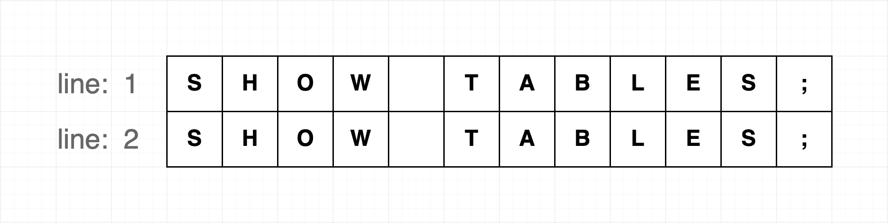
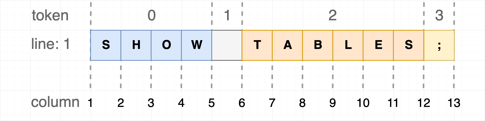

# dt-sql-parser

[![NPM version][npm-image]][npm-url] [![NPM downloads][download-img]][download-url] [![Chat][online-chat-img]][online-chat-url]

[npm-image]: https://img.shields.io/npm/v/dt-sql-parser.svg?style=flat-square
[npm-url]: https://www.npmjs.com/package/dt-sql-parser

[download-img]: https://img.shields.io/npm/dm/dt-sql-parser.svg?style=flat
[download-url]: https://www.npmjs.com/package/dt-sql-parser

[online-chat-img]: https://img.shields.io/discord/920616811261743104?logo=Molecule
[online-chat-url]: https://discord.gg/uVvq6mfPfa

English | [简体中文](./README-zh_CN.md)

dt-sql-parser is a **SQL Parser** project built with [ANTLR4](https://github.com/antlr/antlr4), and it's mainly for the **BigData** field. The [ANTLR4](https://github.com/antlr/antlr4) generated the basic Parser, Visitor, and Listener, so it's easy to complete the **Lexer**, **Parser**, **traverse the AST**, and so on features.

Additionally, it provides advanced features such as **SQL Validation**, **Code Completion** and **Collecting Table and Columns in SQL**.

**Supported SQL**:

- MySQL
- Flink
- Spark
- Hive
- PostgreSQL
- Trino
- Impala

>[!TIP]
>This project is the default for Typescript target, also you can try to compile it to other languages if you need.

<br/>

## Integrating SQL Parser with Monaco Editor

We also have provided [monaco-sql-languages](https://github.com/DTStack/monaco-sql-languages) to easily to integrate `dt-sql-parser` with `monaco-editor`.

<br/>

## Installation

```bash
# use npm
npm i dt-sql-parser --save

# use yarn
yarn add dt-sql-parser
```

<br/>

## Usage
We recommend learning the fundamentals usage before continuing. The dt-sql-parser library provides SQL classes for different types of SQL.
```javascript
import { MySQL, FlinkSQL, SparkSQL, HiveSQL, PostgreSQL, TrinoSQL, ImpalaSQL } from 'dt-sql-parser';
```

Before using syntax validation, code completion, and other features, it is necessary to instantiate the Parser of the relevant SQL type.
For instance, one can consider using `MySQL` as an example:
```javascript
const mysql = new MySQL();
```

The following usage examples will utilize the `MySQL`, and the Parser for other SQL types will be used in a similar manner as `MySQL`.

### Syntax Validation
First instanced a Parser object, then call the **validate** method on the SQL instance to validate the sql content, if failed returns an array includes **error** message.

```javascript
import { MySQL } from 'dt-sql-parser';

const mysql = new MySQL();
const incorrectSql = 'selec id,name from user1;';
const errors = mysql.validate(incorrectSql);

console.log(errors); 
```

*output:*

```javascript
/*
[
  {
    endCol: 5,
    endLine: 1,
    startCol: 0,
    startLine: 1,
    message: "..."
  }
]
*/
```


### Tokenizer

Call the `getAllTokens` method on the SQL instance:

```javascript
import { MySQL } from 'dt-sql-parser';

const mysql = new MySQL()
const sql = 'select id,name,sex from user1;'
const tokens = mysql.getAllTokens(sql)

console.log(tokens)
```

*output:*

```javascript
/*
[
  {
    channel: 0
    column: 0
    line: 1
    source: [SqlLexer, InputStream]
    start: 0
    stop: 5
    tokenIndex: -1
    type: 137
    _text: null
  },
  ...
]
*/
```

### Visitor

Traverse the tree node by the Visitor:

```typescript
import { MySQL, MySqlParserVisitor } from 'dt-sql-parser';

const mysql = new MySQL();
const sql = `select id, name from user1;`;
const parseTree = mysql.parse(sql);

class MyVisitor extends MySqlParserVisitor<string> {
    defaultResult(): string {
        return '';
    }
    aggregateResult(aggregate: string, nextResult: string): string {
        return aggregate + nextResult;
    }
    visitProgram = (ctx) => {
        return this.visitChildren(ctx);
    };
    visitTableName = (ctx) => {
        return ctx.getText();
    };
}
const visitor = new MyVisitor();
const result = visitor.visit(parseTree);

console.log(result);
```

*output:*

```javascript
/*
user1
*/
```

### Listener

Access the specified node in the AST by the Listener

```typescript
import { MySQL, MySqlParserListener } from 'dt-sql-parser';

const mysql = new MySQL();
const sql = 'select id, name from user1;';
const parseTree = mysql.parse(sql);

class MyListener extends MySqlParserListener {
    result = '';
    enterTableName = (ctx): void => {
        this.result = ctx.getText();
    };
}

const listener = new MyListener();
mysql.listen(listener, parseTree);

console.log(listener.result)
```

*output:*

```javascript
/*
user1
*/
```

### Splitting SQL statements
Take `FlinkSQL` as an example, call the `splitSQLByStatement` method on the SQL instance:

```javascript
import { FlinkSQL } from 'dt-sql-parser';

const flink = new FlinkSQL();
const sql = 'SHOW TABLES;\nSELECT * FROM tb;';
const sqlSlices = flink.splitSQLByStatement(sql);

console.log(sqlSlices)
```

*output:*

```javascript
/*
[
  {
    startIndex: 0,
    endIndex: 11,
    startLine: 1,
    endLine: 1,
    startColumn: 1,
    endColumn: 12,
    text: 'SHOW TABLES;'
  },
  {
    startIndex: 13,
    endIndex: 29,
    startLine: 2,
    endLine: 2,
    startColumn: 1,
    endColumn: 17,
    text: 'SELECT * FROM tb;'
  }
]
*/
```

### Code Completion
Obtaining code completion information at a specified position in SQL.

Call the `getAllEntities` method on the SQL instance, pass the SQL content and the row and column numbers indicating the position where code completion is desired. The following are some additional explanations about [CaretPosition](#caretposition-of-code-completion).
+ **keyword candidates list**

    ```javascript
    import { FlinkSQL } from 'dt-sql-parser';
  
    const flink = new FlinkSQL();
    const sql = 'CREATE ';
    const pos = { lineNumber: 1, column: 16 }; // the end position
    const keywords = flink.getSuggestionAtCaretPosition(sql, pos)?.keywords;
  
    console.log(keywords);
    ```
    *output:*
    ```javascript
    /*
    [ 'CATALOG', 'FUNCTION', 'TEMPORARY', 'VIEW', 'DATABASE', 'TABLE' ] 
    */
    ```
+  **Obtaining information related to grammar completion**
    ```javascript
    import { FlinkSQL } from 'dt-sql-parser';

    const flink = new FlinkSQL();
    const sql = 'SELECT * FROM tb';
    const pos = { lineNumber: 1, column: 16 }; // after 'tb'
    const syntaxSuggestions = flink.getSuggestionAtCaretPosition(sql, pos)?.syntax;

    console.log(syntaxSuggestions);
    ```
    *output:*
    ```javascript
    /*
    [
      {
        syntaxContextType: 'table',
        wordRanges: [
          {
            text: 'tb',
            startIndex: 14,
            stopIndex: 15,
            line: 1,
            startColumn: 15,
            stopColumn: 16
          }
        ]
      },
      {
        syntaxContextType: 'view',
        wordRanges: [
          {
            text: 'tb',
            startIndex: 14,
            stopIndex: 15,
            line: 1,
            startColumn: 15,
            stopColumn: 16
          }
        ]
      }
    ]
    */
    ```
The grammar-related code completion information returns an array, where each item represents what grammar can be filled in at that position. For example, the output in the above example represents that the position can be filled with either a **table name** or **a view name**. In this case, `syntaxContextType` represents the type of grammar that can be completed, and `wordRanges` represents the content that has already been filled.


### Get all entities in SQL (e.g. table, column)
Call the `getAllEntities` method on the SQL instance, and pass in the sql text and the row and column numbers at the specified location to easily get them.

```typescript
  import { FlinkSQL } from 'dt-sql-parser';

  const flink = new FlinkSQL();
  const sql = 'SELECT * FROM tb;';
  const pos = { lineNumber: 1, column: 16 }; // tb 的后面
  const entities = flink.getAllEntities(sql, pos);

  console.log(entities);
```

*output*

```typescript
/*
  [
    {
      entityContextType: 'table',
      text: 'tb',
      position: {
        line: 1,
        startIndex: 14,
        endIndex: 15,
        startColumn: 15,
        endColumn: 17
      },
      belongStmt: {
        stmtContextType: 'selectStmt',
        position: [Object],
        rootStmt: [Object],
        parentStmt: [Object],
        isContainCaret: true
      },
      relatedEntities: null,
      columns: null,
      _alias: null,
      _comment: null
    }
  ]
*/
```

Position is not required, if the position is passed, then in the collected entities, if the entity is located under the statement where the corresponding position is located, then the statement object to which the entity belongs will be marked with `isContainCaret`, which can help you quickly filter out the required entities when combined with the code completion function.

In nested subquery scenarios, `isContainCaret` may not be sufficient to filter out the required entities. For example, for SQL: `SELECT id FROM t1 LEFT JOIN (SELECT id, name FROM t2) AS t3 ON t1.id = t3.id`, when our cursor is inside the inner query `t3` derived table, we expect to provide field completion for the `t2` table, but since both `t1` and `t2` have `isContainCaret` as `true`, we cannot distinguish available table entities in more detail.

Therefore, for entity types with `entityContextType` as `table`, collected entities will have an `isAccessible` flag to indicate whether the entity is accessible. `isAccessible` uses scope depth internally to determine accessibility. When the entity's statement scope depth equals the cursor's statement scope depth and `isContainCaret` is `true`, the entity is considered accessible (though this determination method is not absolute, it can exclude most irrelevant entities).

#### Additional Entity Information

**Alias Information**

When an entity has an alias, the entity object will contain the `_alias` field:
- `_alias`: Detailed alias information, including text content and position information

```typescript
// Example: SELECT u.name FROM users AS u
{
  entityContextType: 'table',
  text: 'users',
  _alias: {        // Table alias information
    text: 'u',
    startIndex: 29,
    endIndex: 29,
    startColumn: 30,
    endColumn: 31,
    line: 1
  }
}

// Example: SELECT name AS username FROM users
{
  entityContextType: 'column',
  text: 'name',
  _alias: {        // Column alias information
    text: 'username',
    startIndex: 15,
    endIndex: 22,
    startColumn: 16,
    endColumn: 24,
    line: 1
  }
}
```

**Declaration Type (DeclareType)**

The `declareType` field identifies how an entity is declared, with different entity types having different declaration types:

**Table Entity Declaration Types (TableDeclareType):**
- `LITERAL`: Literal table name, e.g., `SELECT * FROM users`
- `EXPRESSION`: Table defined by expression, e.g., subquery `SELECT * FROM (SELECT * FROM users) AS t`

**Column Entity Declaration Types (ColumnDeclareType):**
- `LITERAL`: Literal column name, e.g., `SELECT id, name FROM users`
- `ALL`: Wildcard syntax, e.g., `SELECT users.* FROM users`
- `EXPRESSION`: Complex expressions like subqueries, CASE statements, function calls, etc.

```typescript
// Examples of different declareType values
// 1. Literal column
{
  entityContextType: 'column',
  text: 'name',
  declareType: ColumnDeclareType.LITERAL,
}

// 2. Wildcard column
{
  entityContextType: 'column', 
  text: 'users.*',
  declareType: ColumnDeclareType.ALL,
}

// 3. Expression column
{
  entityContextType: 'column',
  text: 'CASE WHEN age > 18 THEN "adult" ELSE "minor" END',
  declareType: ColumnDeclareType.EXPRESSION,
}
```

**Other Metadata Fields**

**Comment Information**
- `_comment`: Entity comment information, mainly used for column or table comments in CREATE statements

```typescript
// Example: CREATE TABLE users (id INT COMMENT 'USERID', name VARCHAR(50) COMMENT 'USERNAME')
{
  entityContextType: 'column',
  text: 'id',
  _comment: {
    text: "'USERID'",
    startIndex: 35,
    endIndex: 42,
    startColumn: 36,
    endColumn: 44,
    line: 1
  },
  _colType: {
    text: 'INT',
    startIndex: 23,
    endIndex: 42,
    startColumn: 24,
    endColumn: 44,
    line: 1
  }
}
```

**Column Type Information**
- `_colType`: Column data type information, only used for column entities in CREATE TABLE statements, includes type name and position information

```typescript
// Example: CREATE TABLE users (name VARCHAR(50) NOT NULL)
{
  entityContextType: 'columnCreate',
  text: 'name',
  _colType: {
    text: 'VARCHAR(50)',
    startIndex: 25,
    endIndex: 35,
    startColumn: 26,
    endColumn: 37,
    line: 1
  }
}
```

**Relationship Fields**
- `relatedEntities`: List of other entities related to the current entity, e.g., query result entities related to table entities
- `columns`: List of contained columns

A simple entity relationship example:

```sql
CREATE TABLE tb1 AS SELECT id FROM tb2;
```


### Get semantic context information

Call the `getSemanticContextAtCaretPosition` method on the SQL instance, passing in the sql text and the line and column numbers at the specified position, for example:

```typescript
import { HiveSQL } from 'dt-sql-parser';

const hive = new HiveSQL();
const sql = 'SELECT * FROM tb;';
const pos = { lineNumber: 1, column: 18 }; // after 'tb;'
const semanticContext = hive.getSemanticContextAtCaretPosition(sql, pos);

console.log(semanticContext);
```

*output*

```typescript
/*
{
  isStatementBeginning: true,
}
*/
```

Currently, the semantic context information that can be collected is as follows. If there are more requirements, please submit an [issue](https://github.com/DTStack/dt-sql-parser/issues).

- `isStatementBeginning` Whether the current input position is the beginning of a statement

The **default strategy** for `isStatementBeginning` is `SqlSplitStrategy.STRICT`

There are two optional strategies:
- `SqlSplitStrategy.STRICT` Strict strategy, only the statement delimiter `;` is used as the identifier for the end of the previous statement
- `SqlSplitStrategy.LOOSE` Loose strategy, based on the syntax parsing tree to split SQL

The difference between the two strategies:
For example, if the input SQL is:
```sql
CREATE TABLE tb (id INT)

SELECT
```
In the `SqlSplitStrategy.STRICT` strategy, `isStatementBeginning` is `false`, because the CREATE statement is not terminated by a semicolon.

In the `SqlSplitStrategy.LOOSE` strategy, `isStatementBeginning` is `true`, because the syntax parsing tree splits the SQL into two independent statements: CREATE and SELECT.

You can set the strategy through the third `options` parameter:
```typescript
hive.getSemanticContextAtCaretPosition(sql, pos, { splitSqlStrategy: SqlSplitStrategy.LOOSE });
```

### Other API

- `createLexer` Create an instance of Antlr4 Lexer and return it;
- `createParser` Create an instance of Antlr4 parser and return it;
- `parse` Parses the input SQL and returns the parse tree;

<br/>

## Position and Range
Some return results of the APIs provided by `dt-sql-parser` contain text information, among which the range and start value of line number, column number and index may cause some confusion.

### Index
The index starts at 0. In the programming field, it is more intuitive.


For an index range, the start index starts from 0 and ends with n-1, as shown in the figure above, an index range of blue text should be represented as follows:

```javascript
{
    startIndex: 0,
    endIndex: 3
}
```

### Line
The line starts at 1.



For a range of multiple lines, the line number starts from 1 and ends with n. A range of the first and second lines is represented as follows:

```javascript
{
    startLine: 1,
    endLine: 2
}
```

### Column 
The column also starts at 1.


It is easier to understand by comparing the column number with the cursor position of the editor. For a range of multiple columns, the column number starts from 1 and ends with n+1, as shown in the figure above, a range of blue text columns is represented as follows:

```javascript
{
    startColumn: 1,
    endColumn: 5
}
```

### CaretPosition Of Code Completion
The code completion of `dt-sql-parser` was designed to be used in the editor, so the format of the second parameter (CaretPosition) of the `getSuggestionAtCaretPosition` method is line and column number instead of character position index. This makes it easier to integrate the code completion into the editor. For the editor, it only needs to get the text content and cursor position in the editor at a specific time to call the code completion of `dt-sql-parser`, without any additional calculation.

But in some other scenarios, you may need to get the caret position required by the code completion through conversion or calculation. Then, there are some precautions that you may need to care about before that.

The code completion of `dt-sql-parser` depends on [antlr4-c3](https://github.com/mike-lischke/antlr4-c3), which is a great library. The code completion of `dt-sql-parser` is just encapsulated and converted based on antlr4-c3, including converting the line and column number information into the token index required by antlr4-c3, as shown in the figure below:



Regard the column in the figure as the cursor position, and put this text into the editor, you will get 13 possible cursor positions, while for dt-sql-parser, this text will generate 4 Tokens after being parsed. An important strategy of the code completion is: **When the cursor (CaretPosition) has not completely left a Token, dt-sql-parser thinks that this Token has not been completed, and the code completion will infer what can be filled in the position of this Token.**

For example, if you want to know what to fill in after `SHOW` through the code completion, the caret position should be:

```javascript
{
    lineNumber: 1,
    column: 6
}
```

At this time, dt-sql-parser will think that `SHOW` is already a complete Token, and it should infer what can be filled in after `SHOW`. If the column in the passed-in caret position is 5, then dt-sql-parser will think that `SHOW` has not been completed, and then infer what can be filled in the position of `SHOW`. In other words, in the figure above, `column: 5` belongs to `token: 0`, and `column: 6` belongs to `token: 1`.

For the editor, this strategy is also more intuitive. After the user enters `SHOW`, before pressing the space key, the user probably has not finished entering, maybe the user wants to enter something like `SHOWS`. When the user presses the space key, the editor thinks that the user wants to enter the next Token, and it is time to ask dt-sql-parser what can be filled in the next Token position.

<br/>

## Contributing

Refer to [CONTRIBUTING](./CONTRIBUTING.md)

## License

[MIT](./LICENSE)
